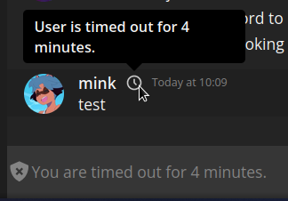

import { Code } from '@astrojs/starlight/components';
import importedCode from './exampleFetch.ts?raw';

## Authentication

To authenticate with the API, you must first acquire a bot token or user token:

- **Bot:** create one from user settings in the client
- **User:** copy one from client or [authenticate manually](/developers/api/reference.html#tag/session/post/auth/session/login) through API

Then you may provide these through either:

| Type |      Header       |
| :--: | :---------------: |
| Bot  |   `X-Bot-Token`   |
| User | `X-Session-Token` |

When dealing with an authenticated route.

## Rate Limits

Revolt uses a fixed-window ratelimiting algorithm:

- You are given a set amount of calls per each named bucket.
- Any calls past this limit will result in 429 errors.
- Buckets are replenished after 10 seconds from initial request.

### Buckets

There are distinct buckets that you may be calling against, none of these affect each other and can be used up independently of one another.

|   Method | Path                        | Limit |
| -------: | --------------------------- | :---: |
|          | `/users`                    |  20   |
|  `PATCH` | `/users/:id`                |   2   |
|          | `/users/:id/default_avatar` |  255  |
|          | `/bots`                     |  10   |
|          | `/channels`                 |  15   |
|   `POST` | `/channels/:id/messages`    |  10   |
|          | `/servers`                  |   5   |
|          | `/auth`                     |   3   |
| `DELETE` | `/auth`                     |  255  |
|          | `/safety`                   |  15   |
|          | `/safety/report`            |   3   |
|          | `/swagger`                  |  100  |
|          | `/*`                        |  20   |

### Headers

There are multiple headers you can use to figure out when you can and cannot send requests, and to determine when you can next send a request.

| Header                    |   Type   | Description                                      |
| ------------------------- | :------: | ------------------------------------------------ |
| `X-RateLimit-Limit`       | `number` | Maximum number of calls allowed for this bucket. |
| `X-RateLimit-Bucket`      | `string` | Unique identifier for this bucket.               |
| `X-RateLimit-Remaining`   | `number` | Remaining number of calls left for this bucket.  |
| `X-RateLimit-Reset-After` | `number` | Milliseconds left until calls are replenished.   |

### Rate Limited Response

When you receive `429 Too Many Requests`, you will also receive a JSON body with the schema:

```typescript
interface Response {
  // Milliseconds until calls are replenished
  retry_after: number;
}
```

## Permissions

Revolt's permission system works by sequentially applying allows then denies.

[//]: # (TODO: Add flowchart via mermaid)

If you are looking to implement permissions in a library, I highly recommend reading either `revolt.js` or `delta` source code since all the routines are well commented and should be relatively easy to understand.

### Values

The following permissions are currently allocated:

<details>
<summary>Permissions</summary>

| Name                  |     Value     |  Bitwise  | Description                                             |
| --------------------- | :-----------: | :-------: | ------------------------------------------------------- |
| `ManageChannel`       |      `1`      | `1 << 0`  | Manage the channel or channels on the server            |
| `ManageServer`        |      `2`      | `1 << 1`  | Manage the server                                       |
| `ManagePermissions`   |      `4`      | `1 << 2`  | Manage permissions on servers or channels               |
| `ManageRole`          |      `8`      | `1 << 3`  | Manage roles on server                                  |
| `ManageCustomisation` |     `16`      | `1 << 4`  | Manage emoji on servers                                 |
| `KickMembers`         |     `64`      | `1 << 6`  | Kick other members below their ranking                  |
| `BanMembers`          |     `128`     | `1 << 7`  | Ban other members below their ranking                   |
| `TimeoutMembers`      |     `256`     | `1 << 8`  | Timeout other members below their ranking               |
| `AssignRoles`         |     `512`     | `1 << 9`  | Assign roles to members below their ranking             |
| `ChangeNickname`      |    `1024`     | `1 << 10` | Change own nickname                                     |
| `ManageNicknames`     |    `2048`     | `1 << 11` | Change or remove other's nicknames below their ranking  |
| `ChangeAvatar`        |    `4096`     | `1 << 12` | Change own avatar                                       |
| `RemoveAvatars`       |    `8192`     | `1 << 13` | Remove other's avatars below their ranking              |
| `ViewChannel`         |   `1048576`   | `1 << 20` | View a channel                                          |
| `ReadMessageHistory`  |   `2097152`   | `1 << 21` | Read a channel's past message history                   |
| `SendMessage`         |   `4194304`   | `1 << 22` | Send a message in a channel                             |
| `ManageMessages`      |   `8388608`   | `1 << 23` | Delete messages in a channel                            |
| `ManageWebhooks`      |  `16777216`   | `1 << 24` | Manage webhook entries on a channel                     |
| `InviteOthers`        |  `33554432`   | `1 << 25` | Create invites to this channel                          |
| `SendEmbeds`          |  `67108864`   | `1 << 26` | Send embedded content in this channel                   |
| `UploadFiles`         |  `134217728`  | `1 << 27` | Send attachments and media in this channel              |
| `Masquerade`          |  `268435456`  | `1 << 28` | Masquerade messages using custom nickname and avatar    |
| `React`               |  `536870912`  | `1 << 29` | React to messages with emojis                           |
| `Connect`             | `1073741824`  | `1 << 30` | Connect to a voice channel                              |
| `Speak`               | `2147483648`  | `1 << 31` | Speak in a voice call                                   |
| `Video`               | `4294967296`  | `1 << 32` | Share video in a voice call                             |
| `MuteMembers`         | `8589934592`  | `1 << 33` | Mute other members with lower ranking in a voice call   |
| `DeafenMembers`       | `17179869184` | `1 << 34` | Deafen other members with lower ranking in a voice call |
| `MoveMembers`         | `34359738368` | `1 << 35` | Move members between voice channels                     |
</details>

## Uploading Files

File uploads work by first sending a file to the server and then using the ID provided.

You can find out what kinds of files you can upload by visiting [autumn.revolt.chat](https://autumn.revolt.chat).
This may depend on your instance, so you should determine the endpoint from the root API response.

To upload a file, pick the desired tag then send a **POST** to `{endpoint}/{tag}` along with a `multipart/form-data` body with one field `file` that contains the file you wish to upload.

You will receive the following JSON response:

```json
{
  "id": "0"
}
```

You can use the ID wherever a file is required in the API.

Code sample in JavaScript using Fetch API:

<Code code={importedCode} lang="ts" title="example.ts" />

### Serving images

For caching purposes, use the following URL templates for file previews:

| Tag         | URL                                  |
| ----------- | ------------------------------------ |
| icons       | `{endpoint}/icons/{id}?max_side=256` |
| banners     | -                                    |
| emojis      | -                                    |
| backgrounds | `{endpoint}/backgrounds/{id}?width=1000`                                    |
| avatars     | `{endpoint}/icons/{id}?max_side=256` |
| attachments | `{endpoint}/attachments/{id}?max_side=512`                                    |

Parameters may be forced in the future. Missing URLs _to be added_.

## Changelog

You can find the API changelog on the [releases page on GitHub](https://github.com/revoltchat/backend/releases)!

## Legacy Changelog

### Gap in data

This is missing stuff between the one above and the one below.

### 20230120-1: New Account Events

This update adds two new events:

- `UserPlatformWipe { user_id: String; flags: Int; }`
- `Auth { event_type: 'DeleteSession' | 'DeleteAllSessions'; [..] }` (see [Auth](/stack/bonfire/events#auth))

It also adds a new user flag of value `8` which represents a user who has been flagged and removed as spam.

It also adds one REST routes:

- `GET /users/<user_id>/flags`: Fetch user flags

If your account is disabled, login will no longer throw an error, instead it will return `Disabled { user_id: String }` with status code 200.

You must now also specify a list of reactions when enabling restrict reactions.

### 20220903-1: Changes to role colours, masquerades, members and user timeouts

Role colours now support most valid CSS gradients and colours up to 128 characters and which satisfy the following Regex:

```regex
(?i)^(?:[a-z ]+|var\(--[a-z\d-]+\)|rgba?\([\d, ]+\)|#[a-f0-9]+|(repeating-)?(linear|conic|radial)-gradient\(([a-z ]+|var\(--[a-z\d-]+\)|rgba?\([\d, ]+\)|#[a-f0-9]+|\d+deg)([ ]+(\d{1,3}%|0))?(,[ ]*([a-z ]+|var\(--[a-z\d-]+\)|rgba?\([\d, ]+\)|#[a-f0-9]+)([ ]+(\d{1,3}%|0))?)+\))$
```

You can now also masquerade role colours per-message, simply include the `colour` property matching the properties above.

All members now include a `joined_at` property which indicate when the timestamp at which they joined a certain server.

All members now also have a `timeout` property which can be changed by `PATCH /servers/<server_id>/members/<user_id>`, users will not be able to interact with the server until the time expires. A visual indicator will also display on the user's end as well as for others in chat:



### 20220901-1: Reactions Update

This update adds support for message reactions, including the following REST routes:

- `PUT /channels/<id>/messages/<id>/reactions/<emoji>`: Add reaction to message
- `DELETE /channels/<id>/messages/<id>/reactions/<emoji>`: Remove reaction from message
- `DELETE /channels/<id>/messages/<id>/reactions`: Remove all reaction from a message

It adds a new permission `React` with value `536870912`.

It adds three new events:

- `MessageReact { id: String; channel_id: String; user_id: String; emoji_id: String; }`
- `MessageUnreact { id: String; channel_id: String; user_id: String; emoji_id: String; }`
- `MessageRemoveReaction { id: String; channel_id: String; emoji_id: String; }`

### 20220707-1: Emoji Update

This update adds support for server emojis, including the following REST routes:

- `GET /custom/emoji/<id>`: Get an existing emoji
- `PUT /custom/emoji/<id>`: Create a new emoji (uses Autumn id)
- `DELETE /custom/emoji/<id>`: Delete an emoji
- `GET /server/<id>/emojis`: Fetch all emoji in a server

It adds a new permission `ManageCustomisation` with value `8`.

It includes a new field in the `Ready` payload: `emojis?: Emoji[]`.

It adds two new events:

- `EmojiCreate(Emoji)`
- `EmojiDelete { id: String }`

### 20220608-1: Friends API v2

To accomodate the new Unicode usernames, the existing add friend route is being split into two different routes:

- `PUT /users/{target}/friend`: Accept friend request where `{target}` is an ID
- `POST /users/friend`: Send friend request (with body `{ username: string }`)

The old route will stop accepting usernames in a week, see [20220608-2](/changes/20220608-friends-api-v1-deprecation).

### 20220608-2: 'Send Friend' Deprecation

The `PUT /users/{target}/friend` route will stop accepting usernames in place of `{target}`.
